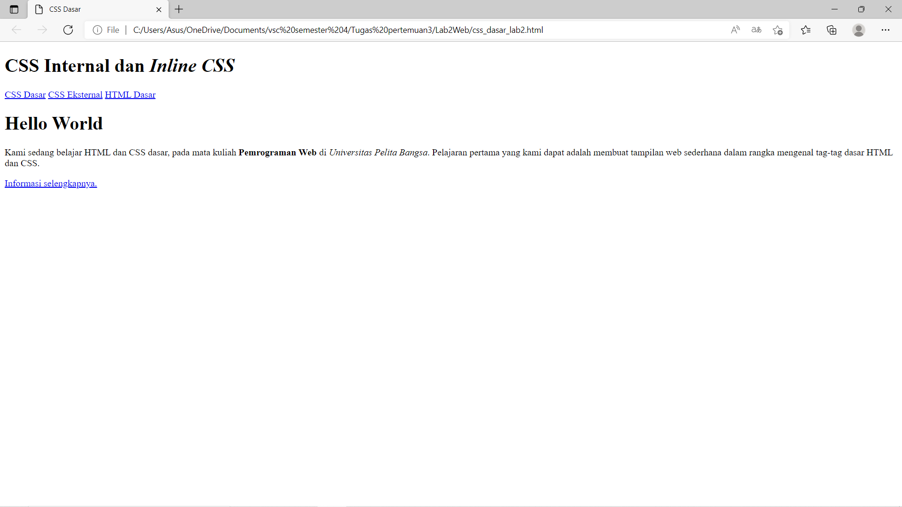
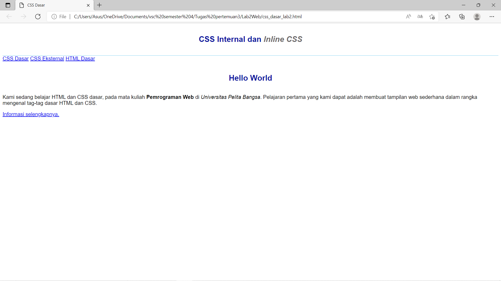
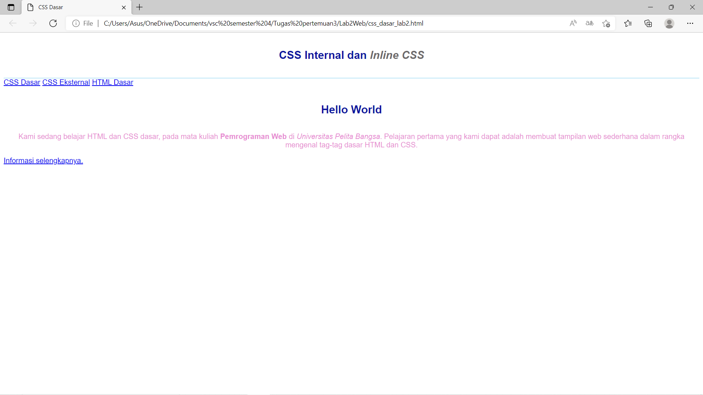
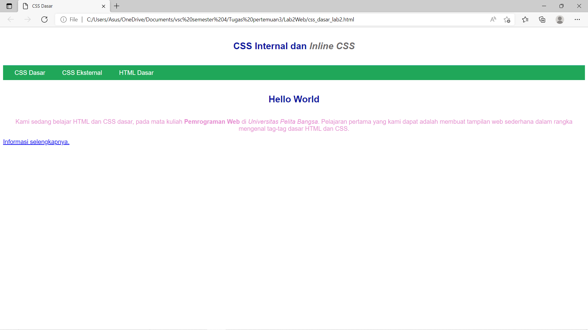
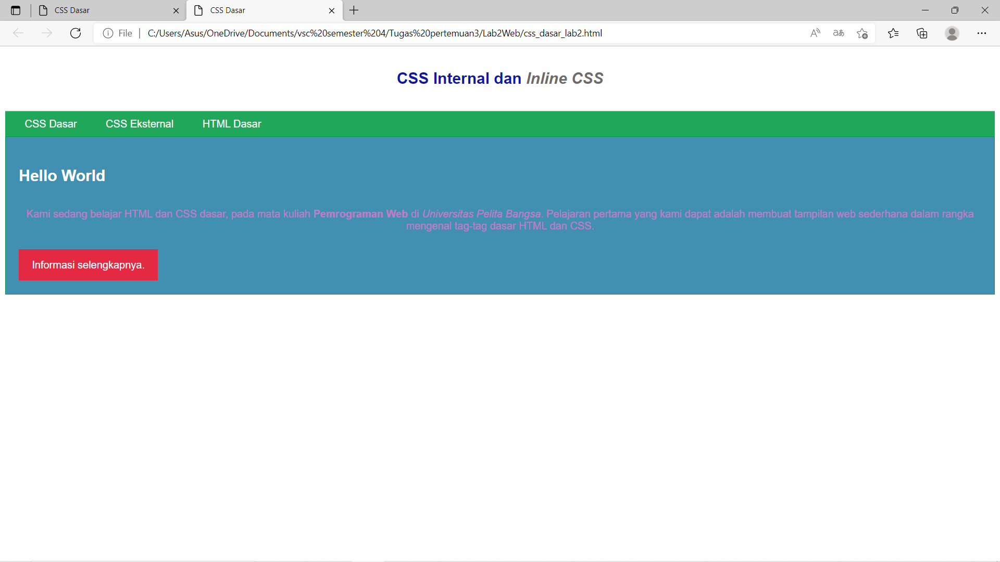

# Lab 2 Web
<hr>
Nama    : Maulana Muhamad <br>

NIM     : 312010188 <br>

Kelas   : TI.20. A.1 <br>
<hr>

 ## 1.Membuat Dokumen HTML
 
Gambar di atas adalah file html yang belum terdapat file css nya , css internal dan css external serta inline <p>

### Dibawah ini Adalah Codingan Dari Gambar Diatas:

```html
<!DOCTYPE html>
<html lang="en">
<head>
    <meta charset="UTF-8">
    <meta name="viewport" content="width=device-width, initial-scale=1.0">
    <title>CSS Dasar</title>
</head>
<body>
    <header>
        <h1>CSS Internal dan <i>Inline CSS</i></h1>
    </header>
    <nav>
        <a href="lab2_css_dasar.html">CSS Dasar</a>
        <a href="lab2_css_eksternal.html">CSS Eksternal</a>
        <a href="lab1_tag_dasar.html">HTML Dasar</a>
    </nav>
    <!-- CSS ID Selector -->
    <div id="intro">
        <h1>Hello World</h1>
    <p>Kami sedang belajar HTML dan CSS dasar, pada mata kuliah <b>Pemrograman
Web</b> di <i>Universitas Pelita Bangsa</i>. Pelajaran pertama yang kami dapat
adalah membuat tampilan web sederhana dalam rangka mengenal tag-tag dasar HTML
dan CSS.</p>
        <!-- CSS Class Selector -->
        <a class="button btn-primary" href="#intro">Informasi selengkapnya.</a>
    </div>
</body>
</html>
```

## 2.Mendeklarasikan CSS Internal


Gambar di atas adalah Css internal. <br>
Css internal adalah css yang file nya terdapat pada dokumen html dengan pendeklarasian style css internal dapat digunakan hanya pada dalam dokumen saja <br>

### Dibawah ini Adalah Codingan Dari Gambar Diatas:
```html
<!DOCTYPE html>
<html lang="en">
<head>
    <meta charset="UTF-8">
    <meta name="viewport" content="width=device-width, initial-scale=1.0">
    <title>CSS Dasar</title>
    <style>
        body {
        font-family:'Open Sans', sans-serif;
        }
        header {
        min-height: 80px;
        border-bottom:1px solid #77CCEF;
        }
        h1 {
        font-size: 24px;
        color: #0F189F;
        text-align: center;
        padding: 20px 10px;
        }
        h1 i {
        color:#6d6a6b;
        }
        </style>
</head>
<body>
    <header>
        <h1>CSS Internal dan <i>Inline CSS</i></h1>
    </header>
    <nav>
        <a href="lab2_css_dasar.html">CSS Dasar</a>
        <a href="lab2_css_eksternal.html">CSS Eksternal</a>
        <a href="lab1_tag_dasar.html">HTML Dasar</a>
    </nav>
    <!-- CSS ID Selector -->
    <div id="intro">
        <h1>Hello World</h1>
    <p>Kami sedang belajar HTML dan CSS dasar, pada mata kuliah <b>Pemrograman
Web</b> di <i>Universitas Pelita Bangsa</i>. Pelajaran pertama yang kami dapat
adalah membuat tampilan web sederhana dalam rangka mengenal tag-tag dasar HTML
dan CSS.</p>
        <!-- CSS Class Selector -->
        <a class="button btn-primary" href="#intro">Informasi selengkapnya.</a>
    </div>
</body>
</html>

```

## 3.Menambahkan Inline CSS


Gambar di atas adalah Css inline <br>
Css inline adalah css yang memiliki prioritas tertinggi dibanding internal dan eksternal <br>

### Dibawah ini Adalah Codingan Dari Gambar Diatas:

```html
<!DOCTYPE html>
<html lang="en">
<head>
    <meta charset="UTF-8">
    <meta name="viewport" content="width=device-width, initial-scale=1.0">
    <title>CSS Dasar</title>
    <style>
        body {
        font-family:'Open Sans', sans-serif;
        }
        header {
        min-height: 80px;
        border-bottom:1px solid #77CCEF;
        }
        h1 {
        font-size: 24px;
        color: #0F189F;
        text-align: center;
        padding: 20px 10px;
        }
        h1 i {
        color:#6d6a6b;
        }
        </style>
</head>
<body>
    <header>
        <h1>CSS Internal dan <i>Inline CSS</i></h1>
    </header>
    <nav>
        <a href="lab2_css_dasar.html">CSS Dasar</a>
        <a href="lab2_css_eksternal.html">CSS Eksternal</a>
        <a href="lab1_tag_dasar.html">HTML Dasar</a>
    </nav>
    <!-- CSS ID Selector -->
    <div id="intro">
        <h1>Hello World</h1>
    <p style="text-align: center; color: #e273cad2 ;">Kami sedang belajar HTML dan CSS dasar, pada mata kuliah <b>Pemrograman
Web</b> di <i>Universitas Pelita Bangsa</i>. Pelajaran pertama yang kami dapat
adalah membuat tampilan web sederhana dalam rangka mengenal tag-tag dasar HTML
dan CSS.</p>
        <!-- CSS Class Selector -->
        <a class="button btn-primary" href="#intro">Informasi selengkapnya.</a>
    </div>
</body>
</html>

```

## 4.Membuat css eksternal


Gambar di atas adalah Css eksternal. <br>
Css eksternal adalah css yang file nya terdapat sumber diluar html dengan melalui link akan terhubung dengan css. <br>

### Codingan Dibawah ini Adalah file baru dengan nama style_eksternal.css kemudian buatlah deklarasi CSS seperti berikut.

```CSS
nav {
    background: #20A759;
    color:#fff;
    padding: 10px;
    }
nav a {
    color: #fff;
    text-decoration: none;
    padding:10px 20px;
    }
nav .active,
nav a:hover {
    background: #0B6B3A;
    }
```

### Kemudian tambahkan tag <link> untuk merujuk file css yang sudah dibuat pada bagian <head>

```HTML
<!-- menyisipkan css eksternal -->
<link rel="stylesheet" href="style_eksternal.css" type="text/css">
```

### Dibawah ini Adalah Codingan Dari Gambar Diatas:

```html
<!DOCTYPE html>
<html lang="en">
<head>
    <meta charset="UTF-8">
    <meta name="viewport" content="width=device-width, initial-scale=1.0">
    <title>CSS Dasar</title>
    <!-- menyisipkan css eksternal -->
<link rel="stylesheet" href="style_eksternal.css" type="text/css">
    <style>
        body {
        font-family:'Open Sans', sans-serif;
        }
        header {
        min-height: 80px;
        border-bottom:1px solid #77CCEF;
        }
        h1 {
        font-size: 24px;
        color: #0F189F;
        text-align: center;
        padding: 20px 10px;
        }
        h1 i {
        color:#6d6a6b;
        }
        </style>
</head>
<body>
    <header>
        <h1>CSS Internal dan <i>Inline CSS</i></h1>
    </header>
    <nav>
        <a href="lab2_css_dasar.html">CSS Dasar</a>
        <a href="lab2_css_eksternal.html">CSS Eksternal</a>
        <a href="lab1_tag_dasar.html">HTML Dasar</a>
    </nav>
    <!-- CSS ID Selector -->
    <div id="intro">
        <h1>Hello World</h1>
    <p style="text-align: center; color: #e273cad2 ;">Kami sedang belajar HTML dan CSS dasar, pada mata kuliah <b>Pemrograman
Web</b> di <i>Universitas Pelita Bangsa</i>. Pelajaran pertama yang kami dapat
adalah membuat tampilan web sederhana dalam rangka mengenal tag-tag dasar HTML
dan CSS.</p>
        <!-- CSS Class Selector -->
        <a class="button btn-primary" href="#intro">Informasi selengkapnya.</a>
    </div>
</body>
</html>
```

## 5.Menambahkan css slector


Gambar di atas adalah Css slector <br>
Css slector adalah css yang deklarasiannya dengan id dan class jika id dilambangkan dengan # Sedangkan class menggunakan. <br>

### Codingan Dibawah ini menambahkan CSS Selector Pada file style_eksternal.css

```CSS
#intro {
    background: #418fb1;
    border: 1px solid #099249;
    min-height: 100px;
    padding: 10px;
    }
    #intro h1 {
    text-align: left;
    border: 0;
    color: #fff;
    }
    /* Class Selector */
    .button {
     padding: 15px 20px;
    background: #bebcbd;
    color: #fff;
    display: inline-block;
    margin: 10px;
    text-decoration: none;
    }
    .btn-primary {
    background: #E42A42;
    }
```

### Dibawah ini Adalah Codingan Dari Gambar Diatas:'

```HTML
<!DOCTYPE html>
<html lang="en">
<head>
    <meta charset="UTF-8">
    <meta name="viewport" content="width=device-width, initial-scale=1.0">
    <title>CSS Dasar</title>
    <!-- menyisipkan css eksternal -->
<link rel="stylesheet" href="style_eksternal.css" type="text/css">
    <style>
        body {
        font-family:'Open Sans', sans-serif;
        }
        header {
        min-height: 80px;
        border-bottom:1px solid #77CCEF;
        }
        h1 {
        font-size: 24px;
        color: #0F189F;
        text-align: center;
        padding: 20px 10px;
        }
        h1 i {
        color:#6d6a6b;
        }
        </style>
</head>
<body>
    <header>
        <h1>CSS Internal dan <i>Inline CSS</i></h1>
    </header>
    <nav>
        <a href="lab2_css_dasar.html">CSS Dasar</a>
        <a href="lab2_css_eksternal.html">CSS Eksternal</a>
        <a href="lab1_tag_dasar.html">HTML Dasar</a>
    </nav>
    <!-- CSS ID Selector -->
    <div id="intro">
        <h1>Hello World</h1>
    <p style="text-align: center; color: #e273cad2 ;">Kami sedang belajar HTML dan CSS dasar, pada mata kuliah <b>Pemrograman
Web</b> di <i>Universitas Pelita Bangsa</i>. Pelajaran pertama yang kami dapat
adalah membuat tampilan web sederhana dalam rangka mengenal tag-tag dasar HTML
dan CSS.</p>
        <!-- CSS Class Selector -->
        <a class="button btn-primary" href="#intro">Informasi selengkapnya.</a>
    </div>
</body>
</html>
```